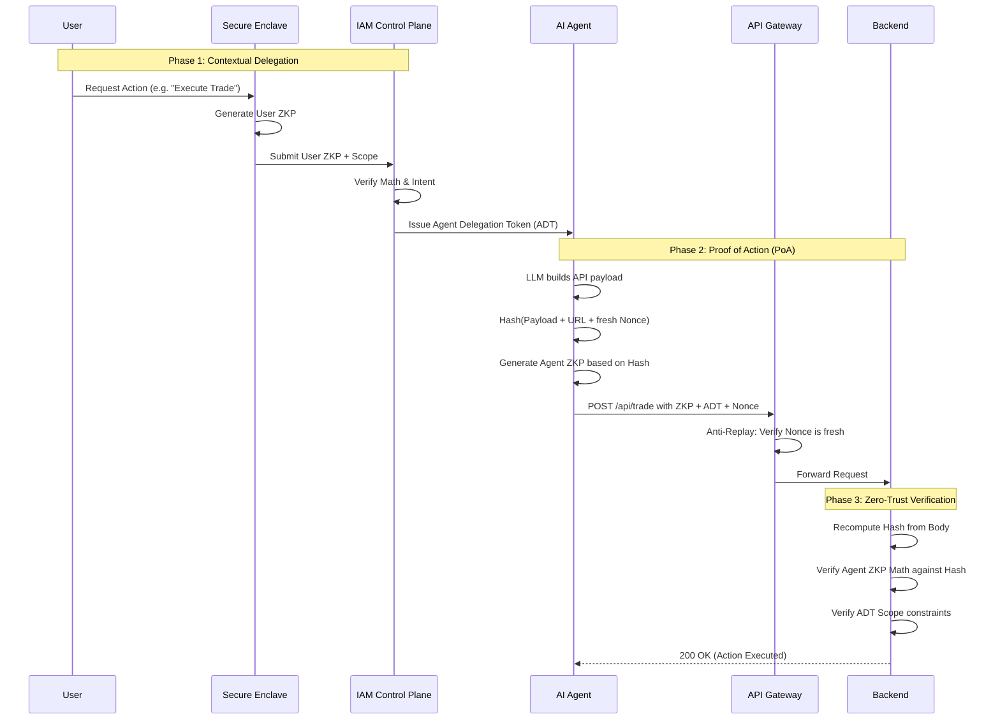

# Trust by Proof: Solving Agentic Delegation with Dual-ZKPs

As detailed in my previous breakdown of [Identity & Access Management in the Era of Agentic AI](/blog/iam-for-agentic-ai), the emerging "Agentic Stack" consisting of tools like SPIFFE, MCP, and Policy-as-Code faces significant implementation hurdles. Massive latency overheads, context leakage vectors, and persistent alert fatigue make traditional delegation models fragile.

To truly solve the issue of granting an agent authority without risking the exposure of user secrets or granting unbounded access, modern systems must combine **User Authentication** with **Agent Authorization** using strict mathematical proofs. 

Unlike traditional Access Control Lists (ACLs) or bearer tokens, a **Dual Zero-Knowledge Proof (Dual-ZKP)** architecture specifically resolves two massive bottlenecks in the agentic stack:
1.  **It eliminates SPIFFE Overhead:** Agents don't need a heavy PKI infrastructure or constant X.509 certificate rotations to prove their machine identity. They evaluate a lightweight cryptographic circuit locally.
2.  **It solves HITL Alert Fatigue:** Because the user sets a cryptographically enforced *Intent Scope* (e.g., "Max $50 transfer") during the initial ZKP-1 generation, the agent is pre-authorized within unbreakable guardrails. Humans don't need to approve every chained action, they rely on 'Trust by Proof' instead of 'Trust by Popup.'

Here is exactly how a Zero-Knowledge architecture solves this:

### 1. User Authentication via ZKP
Instead of the user sending a traditional bearer token (like a JWT) to the agent, the user authenticates locally on their device. Using a **Zero-Knowledge Proof (ZKP)** circuit, the user's device generates a cryptographic proof stating: *"I have successfully authenticated, and I am delegating authority for Task X to Agent Y."* The user's underlying secrets—which heavily depend on the platform but typically include **biometric data (FaceID/TouchID), private keys stored in the Apple Secure Enclave / Android Keystore, FIDO2 WebAuthn credentials, or cryptographic seed phrases**—never leave their secure local hardware.

### 2. Issuing the Agent Context Token
The central IAM control plane verifies the user's ZKP. Upon success, it does *not* give the agent a blanket impersonation token. Instead, it issues a highly scoped, contextually bound **Agent Delegation Token**. 

This token cryptographically binds two distinct elements together:
*   **The Principal (User):** The human who requested the action (verified via their ZKP).
*   **The Scope (Policy):** The exact boundaries of the allowed action (e.g., *"Read access to Database A, valid for exactly 10 minutes"*).

### The Fatal Flaw of JWT Delegation to Agents
You might ask: *Why not just generate a standard JWT (JSON Web Token) with a limited scope and hand it to the agent?* 

This is the catastrophic mistake most organizations are currently making. 
1.  **JWTs are Bearer Tokens:** Whoever holds the token holds the power. If an agent is running a complex chain of thought and suffers a Prompt Injection attack (e.g., an attacker hides malicious instructions in a webpage the agent is summarizing), the attacker can instantly exfiltrate that JWT. The attacker now possesses the user's authority.
2.  **No Cryptographic Binding:** A JWT proves a server signed it, but it does *not* prove who is currently using it. 
3.  **The ZKP Advantage:** ZKPs eliminate the "Bearer Token" problem entirely. By using the Dual-ZKP architecture, the agent never holds a raw token that an attacker can steal and reuse. An attacker exfiltrating the Agent Delegation Token gets a useless piece of data unless they *also* compromise the agent's physical hardware enclave to generate new, mathematically bound Proofs of Action.

### 3. Execution via Proof of Action (PoA)
When the agent attempts to access a backend service, it does not simply present a bearer token. It must generate a new, local Zero-Knowledge Proof. But here is the critical security requirement: **The ZKP must be bound to the specific HTTP request.**

If an agent just proves "I am Agent X" and attaches the Delegation Token, a man-in-the-middle or a malicious proxy could intercept that proof and replay it with a *different* payload (e.g., changing "Book Flight to NYC" to "Transfer Funds to Attacker").

To close this loophole, the architecture requires a **Proof of Action (PoA)**:
1.  The agent hashes its specific API request payload, the URL, and a fresh **cryptographic nonce**.
2.  The agent generates its ZKP, using that specific *Request Hash* as a public input.
3.  The ZKP now mathematically proves: *"I am the authorized agent, AND I am explicitly authorizing this exact payload right now."*

### 4. Zero-Trust Verification
The backend receives the Request, the ZKP, the Nonce, and the Agent Delegation Token. 
1.  The API Gateway checks a fast distributed cache (like Redis) to ensure the Nonce hasn't been used before (defeating **Replay Attacks**).
2.  The backend re-computes the hash of the HTTP body it received.
3.  It verifies the ZKP against that computed hash. If a single byte of the payload was tampered with in transit, the math fails, and the request is dropped (**Payload Tampering defeated**).
4.  It verifies the User's Delegation Token to ensure the action is strictly within the granted scope (**Scope Creep defeated**).

This creates a true Zero-Trust execution environment where compromises are mathematically isolated. Even if the agent's underlying runtime is fully compromised by prompt injection, the attacker cannot forge proofs for malicious payloads or bypass the rigorous cryptographic perimeter.

## Conclusion

Identity is moving from a simple login prompt at the edge of the network to the very center of the execution architecture. By adopting a **Dual-ZKP** approach, organizations can safely deploy autonomous Agentic AI in the enterprise. Instead of relying on vulnerable bearer tokens or introducing human bottlenecks that kill automation, we can explicitly bind stateful cryptographic intent to specific HTTP executions. The autonomous future must be 'Trust by Proof'.
